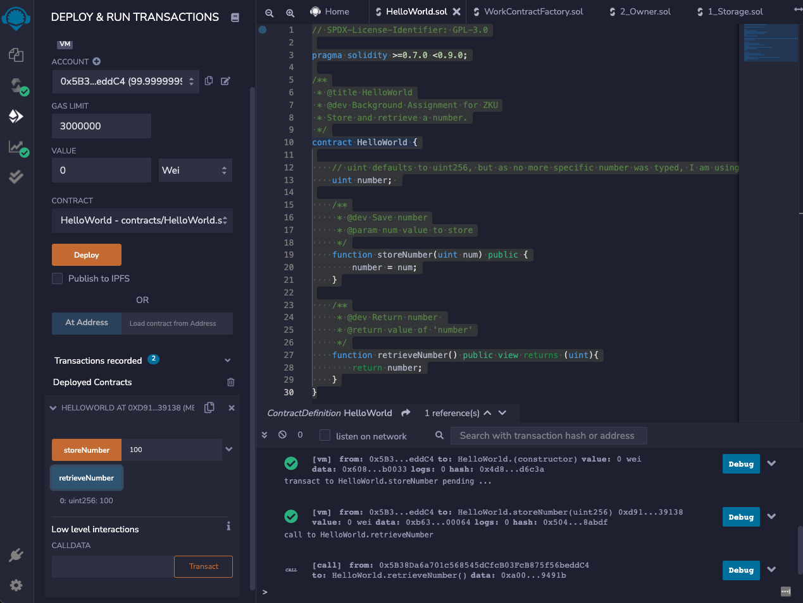

# [Background Assignment](https://harmonyone.notion.site/Background-Assignment-a0d3855f9b9d4728a58b481c30ecfd3f)

## A. Conceptual Knowledge

> 1. What is a smart contract? How are they deployed? You should be able to describe how a smart contract is deployed and the necessary steps.

A smart contract is self-executing, distributed chunk of code that describes and enforces terms or an agreement. A smart contract is compiled into bytecode and an ABI. The byte code is published to a blockchain (ethereum for example). The ABI is used by an application to interact with the smart contract on the block chain. Smart contracts are written usually in Solidity, personally I’ve been using remix for the live compile and testing.
The contract is compiled using some solidity compiler. To actually deploy the compiled smart contract, I’ve used truffle (with their own configs), or ethers.js and infura. You **should** also publish your source code to whatever explorer is most appropriate, but that isn’t strictly speaking necessary for deployment of a smart contract.

> 2. What is gas? Why is gas optimization such a big focus when building smart contracts?

Gas is the fee/cost to execute the smart contract that is payed out to the person or system that is mining or confirming a transaction. Gas optimization is all about reducing the cost of the execution of your smart contract. The more logic / memory / processing it takes to execute a smart contract the more it will cost. Especially when building something like a dApp reducing the cost is critical to keeping your users around. If you are costing them unnecessary money, they won’t want to use your app.

> 3.  What is a hash? Why do people use hashing to hide information?

A hash is the output of a “hashing” algorithm, that takes some chunk of data in, usually encrypts it some way, for example SHA256, and the produces some sort of encoded character based output.

Hashing can add some important properties to data.

- Confidentiality - or encrypting data. This is part of the hashing function that makes it so it is extremely difficult, or ideally all but impossible, to get the original data back out, unless you have the key to decrypt the data.
- Authenticity - you can be sure of who sent you this data, with the public key, because if it was someone else the keys would have produced a different hash.
- Integrity - you can also use a hash to check that data hasn’t been altered because that would produce a different hash.

> 4. How would you prove to a colorblind person that two different colored objects are actually of different colors? You could check out Avi Wigderson talk about a similar problem here.

I would have the colorblind person make two different places / labels that I don’t have access two, like a sheet of paper. Take two different colored objects, that are otherwise identical. Make sure they they know which is “object 1” and which is “object 2”, for example by placing the first object I hand them on one sheet of paper (in a different room) labelled “Object one”, and then give them the second object to place on the sheet of paper labeled “Object 2”. I will be in a separate room so I don’t have any reference to the labeling. The color blind person will randomly select one of the objects and bring it out to me. I (as the prover) will be able o tell them, this is the first (or second) object that I handed you. I could give them the information that it is “blue” or any other color, but I don’t need to. Either way they would be able to verify that I can in fact tell the difference between these two objects based only on color.

## B. You sure you’re solid with Solidity?

> 1. Program a super simple “Hello World” smart contract

[HelloWorld.sol](HelloWorld.sol)

